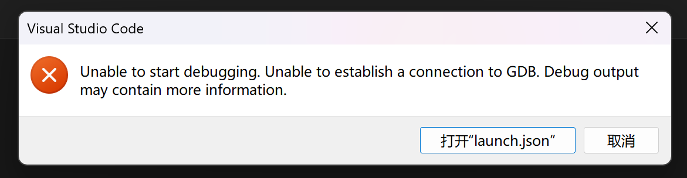
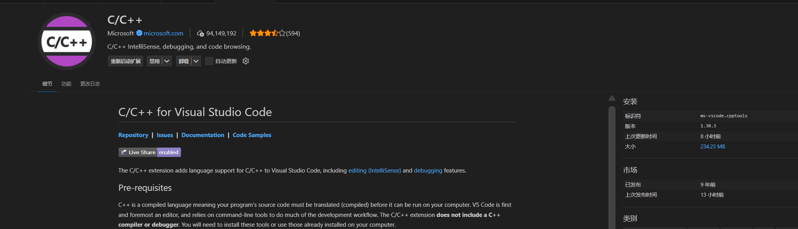

## 问题描述

### 终端报错信息如下

```powershell
PS C:\code files\simp>  & 'c:\Users\curiosity\.vscode\extensions\ms-vscode.cpptools-1.30.3-win32-x64\debugAdapters\bin\WindowsDebugLauncher.exe' '--stdin=Microsoft-MIEngine-In-sdxuhyba.ho2' '--stdout=Microsoft-MIEngine-Out-gpicnm5d.5uj' '--stderr=Microsoft-MIEngine-Error-rshz2kqy.t2w' '--pid=Microsoft-MIEngine-Pid-0qrdv5ww.obf' '--dbgExe=C:\Program Files\mingw64\bin\gdb.exe' '--interpreter=mi' 

   由于 Exception.ToString() 失败，因此无法打印异常字符串。
```

### 报错窗口如下




## 解决思路

​	由于我在问题出现之前的6h还在使用vscode,所以我想应该不是我的工作区.vs配置文档写错了.	

​	根据终端的错误信息我搜索来到了这里

[Vscode does not automatically refresh after external file changes ](https://github.com/microsoft/vscode/issues/21252)

​	然而这里并没有解决方案,但这提示我可能是编辑器本身的问题,但是我并没有动过编辑器本身相关的任何文件.为了排查我还是删除重新安装了vscode,事实证明问题并不出现在这里.

​	如果代码逻辑没变,环境配置文件没变,但功能突然失效,优先怀疑自动更新的插件.

​	我查到我的cpp拓展在近期进行了一次更新,于是我进行了版本回退,问题解决,可以正常调试.



​	终端显示的WindowsDebugLauncher.exe是cpp扩展自带的一个程序(我真是瞎子,在终端报错就应该看出来的).

> c:\Users\curiosity\.vscode\extensions\ms-vscode.cpptools-1.30.3-win32-x64\debugAdapters\bin\WindowsDebugLauncher.exe

​	这个程序负责启动GDB并建立通信隧道,由于扩展更新,该适配器在调用系统路径下的GDB时可能由于某种问题出现了兼容错误.结果就是在终端抛出了异常,该异常信息甚至因为崩溃太快无法通过ToString打印出来,导致神秘报错信息.
