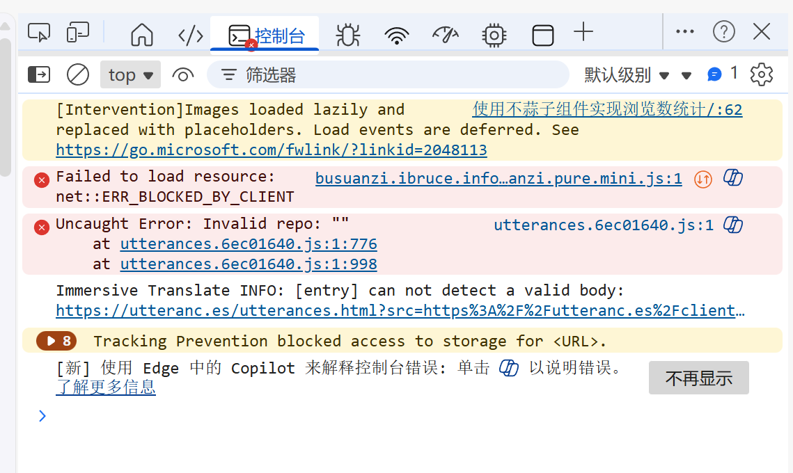
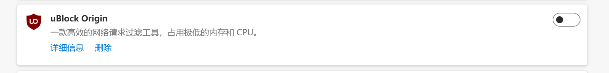

## 参考网址

[不蒜子]([不蒜子 - 极简网页计数器](https://busuanzi.ibruce.info/))

## 布置眼睛的svg文件


布置路径，**名字尽量不要变**

> assets/icons/eye.svg


## 修改配置文件

### 配置文件路径

需要修改两个文件(如果没有就创建),路径分别如下

>  layouts/partials/footer/custom.html

> layouts/partials/article/components/details.html

### 注入

custom.html

```html
<script async src="//busuanzi.ibruce.info/busuanzi/2.3/busuanzi.pure.mini.js"></script>
```


details.html

```html
<div class="article-details">
    {{ if .Params.categories }}
    <header class="article-category">
        {{ range (.GetTerms "categories") }}
            {{ $color := partial "helper/color-from-str" .LinkTitle }}
            {{ $BackgroundColor := default $color.BackgroundColor .Params.style.background }}
            {{ $TextColor := default $color.TextColor .Params.style.color }}
            <a href="{{ .RelPermalink }}" style="background-color: {{ $BackgroundColor | safeCSS }}; color: {{ $TextColor | safeCSS }};">
                {{ .LinkTitle }}
            </a>
        {{ end }}
    </header>
    {{ end }}

    <div class="article-title-wrapper">
        <h2 class="article-title">
            <a href="{{ .RelPermalink }}">
                {{- .Title -}}
            </a>
        </h2>
    
        {{ with .Params.description }}
        <h3 class="article-subtitle">
            {{ . }}
        </h3>
        {{ end }}
    </div>

    {{ $showReadingTime := .Params.readingTime | default (.Site.Params.article.readingTime) }}
    {{ $showDate := not .Date.IsZero }}
    {{ $showFooter := or $showDate $showReadingTime }}
    {{ if $showFooter }}
    <footer class="article-time">
        {{ if $showDate }}
            <div>
                {{ partial "helper/icon" "date" }}
                <time class="article-time--published">
                    {{- .Date.Format "2006-01-02" -}}
                </time>
            </div>
        {{ end }}

        {{ if $showReadingTime }}
            <div>
                {{ partial "helper/icon" "clock" }}
                <time class="article-time--reading">
                    {{ T "article.readingTime" .ReadingTime }}
                </time>
            </div>
        {{ end }}

        <div>
            {{ partial "helper/icon" "eye" }}
            <span class="article-time--reading">
                <span id="busuanzi_container_page_pv">
                    <span id="busuanzi_value_page_pv">...</span> 次阅读
                </span>
            </span>
        </div>
    </footer>
    {{ end }}

    {{ if .IsTranslated }}
        <footer class="article-translations">
            {{ partial "helper/icon" "language" }}
            <div>
                {{ range .Translations }}
                    <a href="{{ .Permalink }}" class="link">{{ .Language.LanguageName }}</a>
                {{ end }}
            </div>
        </footer>
    {{ end }}
</div>
```

## 预览并上传

在hugo根目录输入

```powe
hugo server -D
```

预览无误后,删除掉public文件夹下除了git以外的文件,回到hugo根目录输入

```powe
hugo -D
```

之后正常上传即可

over


## 问题及其解决

### 眼睛图标不显示

确保图片名字和属性严格符合要求

### 不显示浏览数字，只能看到”...“

在博客网页输入f12打开网页控制台，如果出现类似这样的画面



这也许是因为你在浏览器安装了拦截广告的插件误把不蒜子拦截了，关闭即可




### 动态背景与不蒜子冲突

虽然JavaScript是单线程执行的,但浏览器的渲染线程和js脚本解析互斥,所以需要添加延迟和创建执行队列,先处理不蒜子的请求再启动动态背景特效.

以我的网页特效脚本sakura.js举例,它被放置在assets/background/下.

将custom.html修改如下

```html
<script>
    // 延迟 500ms 加载不蒜子
    setTimeout(function() 
    {
        var bsz = document.createElement('script');
        bsz.src = "//busuanzi.ibruce.info/busuanzi/2.3/busuanzi.pure.mini.js";
        document.head.appendChild(bsz);
    }, 500);

    // 延迟 1000ms 加载动态背景
    setTimeout(function() 
    {
        var sakura = document.createElement('script');
        sakura.src = "{{ (resources.Get "background/sakura.js").Permalink }}";
        document.body.appendChild(sakura);
    }, 1000);
</script>
```


## 正常显示画面


